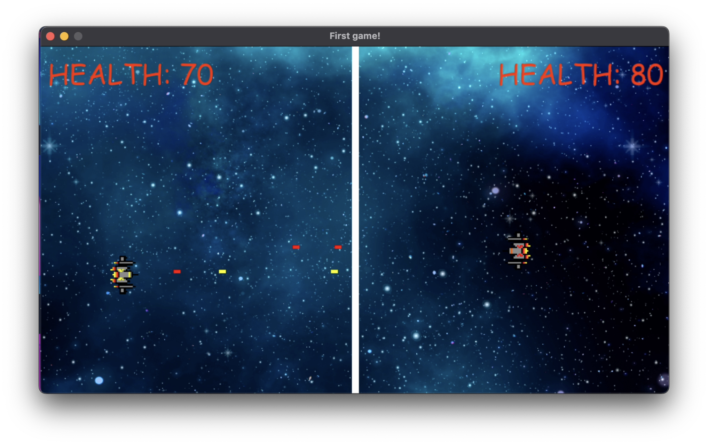
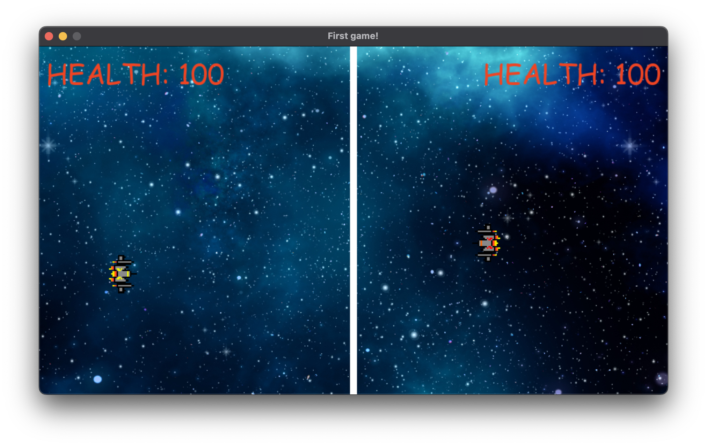
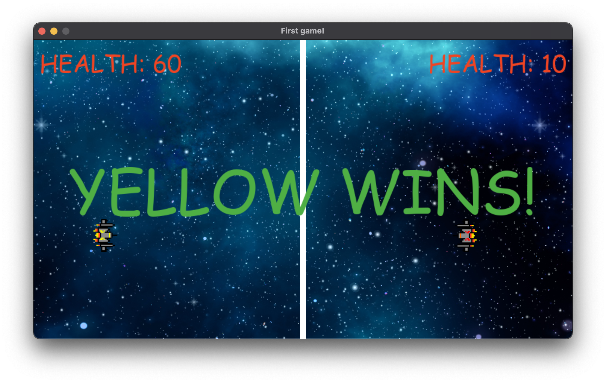

# Spaceship Fight
Developer: *[Puru Soni](https://github.com/puru-soni-04) (purusoni@buffalo.edu)*
***

A simple two-player arcade spaceship shooter game made with Pygame.

## Description

Players control two different spaceships (Red & Yellow) and try to shoot each other down. The game runs until one of the players loses all health.

## How to Run

Ensure you have Python and Pygame installed. To install Pygame:
    
```bash
pip install pygame
```


To run the game:

```bash
python main.py
```


## Controls

**Yellow Spaceship**: 
- `W` - Move Up 
- `S` - Move Down 
- `A` - Move Left 
- `D` - Move Right 
- `Left Alt` (`Left Option` on Mac) - Shoot

**Red Spaceship**:
- `Arrow Up` - Move Up 
- `Arrow Down` - Move Down 
- `Arrow Left` - Move Left 
- `Arrow Right` - Move Right 
- `Right Alt` (`Right Option` on Mac) - Shoot


## Screenshots






## License:

This project is licensed under the MIT License - see the [LICENSE.md](LICENSE.md) file for details.
